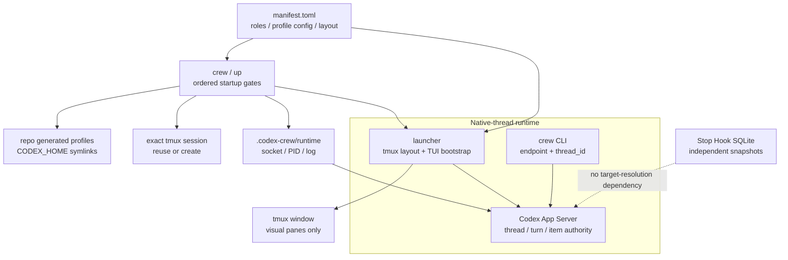

# Design

## Authorities

`loops/index.md` 负责 loop routing；所选 `loops/<loop-id>/manifest.toml` 分别负责该
package 的 ordered roles、runtime profiles、model、reasoning effort、service tier 与
tmux layout。`three-agent-dev` 仍是默认 loop。Package-local Role Markdown 是唯一
editable instruction source，installed profile TOML 只是派生 adapter。

Native `thread_id` 是 control identity。App Server 保存 thread/turn/item lifecycle；
codex-crew 不复制该 authority 到 SQLite 或 tmux。

## One-click startup transaction

`crew LOOP_ID [PROJECT_DIR]` is the global ergonomic entrypoint; existing
`codex-crew up [PROJECT_DIR] --loop LOOP_ID` remains compatible. Both call `up_crew`, which owns
only the stable pre-launch orchestration and returns the unchanged `CrewLaunch` result. An omitted
`crew` project uses the invocation cwd's resolved path; an explicit project overrides it:

1. Resolve the repository and target project, load the manifest, then run deterministic profile
   install and check against `<repo>/.codex-crew/generated/`. `$CODEX_HOME` receives only the
   managed symlinks; Codex auth never enters the repository.
2. Probe `tmux has-session -t =SESSION`. Reuse success; otherwise create only
   `tmux new-session -d -s SESSION -c PROJECT_DIR`. Startup never kills a user session or window.
3. Resolve the fixed endpoint
   `unix://<repo>/.codex-crew/runtime/app-server.sock`. A ready endpoint is reused. Otherwise,
   validate the exact repo runtime directory and PID/socket/log artifact types before starting
   `codex app-server --listen ENDPOINT` with `stdin=DEVNULL`, detached process session, and stdout/
   stderr appended to the repo log.
4. Persist the child PID and poll protocol readiness with a bounded deadline. A dead owned PID
   permits cleanup only of the exact PID/socket paths. An invalid PID, orphan socket, or live PID
   paired with an unready endpoint fails closed without killing or launching over that process.
5. Only after every gate succeeds, call `launch_crew` with the same resolved `codex`, `tmux`,
   project, session, loop, and explicit repo endpoint.

Every high-level `crew`/`up` target therefore shares the repository-owned explicit socket
`unix://<repo>/.codex-crew/runtime/app-server.sock`; this endpoint is never bare `unix://`.
The bare default is confined to low-level diagnostic/control endpoint resolution. Every launched
TUI still receives the explicit endpoint together with `-C` set to the resolved target.

`.codex-crew/` is ignored as one unit, so generated adapters and runtime artifacts never become
canonical source. The tracked authorities remain `bin/`, `codex_crew/`, and `loops/`.

## Launch transaction

1. Validate loop package, target project, tmux session and all manifest profiles.
2. Call paginated `thread/list` with exact `cwd` and interactive
   `sourceKinds=[cli,vscode]` to capture the pre-launch thread-id set. Live remote TUI evidence
   uses both sources, so neither may be excluded. Pagination and socket operations are bounded.
3. Generate one launch nonce and one role-specific marker. Each pane starts a fresh Codex TUI:
   `--profile`, `--strict-config`, `--yolo`, `--remote`, `-C`, bootstrap prompt.
4. Create one window, split horizontally `role_count - 1` times, and apply `even-horizontal`.
   The default `three-agent-dev` therefore splits twice; `api-budget-design` splits three times.
   No tmux option is a control-plane field.
5. Poll `thread/list`, subtract the pre-launch set, and `thread/read(includeTurns=true)` only the
   candidates. A correlation requires the exact marker line, exact `role=...` line, the
   `cwd`-filtered list, `turn.status=completed`, and an authoritative final-phase `agentMessage`
   whose first line exactly equals `role=<role>`.
6. Return a `CrewLaunch` only after every manifest-defined role COMMIT. For the default
   `three-agent-dev` this remains all three roles; for `api-budget-design` it is all four designers.
   Deadline, `failed`, `interrupted`, wrong identity, missing final, or ambiguous matches raise
   `LaunchError` with the exact window ID and affected role. The CLI exits nonzero while preserving
   the visual window for diagnosis.

The production committed-identity deadline is 120 seconds for all manifest-defined profiled
`high` reasoning, Fast service tier bootstrap turns. The default loop has three turns and the
API-budget loop has four. Tests inject much smaller deadlines to exercise the same fail-closed path
without weakening the production default.

No `thread/start`, binding insert, or `codex resume` occurs before TUI startup. A tmux creation
failure kills only the just-created window. Discovery failure after successful pane startup leaves
the visible window intact but never returns a partial-success launch result.

## Native control

Every crew operation accepts `endpoint` and one exact `thread_id`:

- `status`: `thread/read(includeTurns=true)` and validate one-or-zero active turns.
- `send`: read precondition, `turn/start`, bounded `-32001` retry, then reconcile ambiguous
  transport outcome from the before/after turn set and exact user item.
- `steer`: read and require `expectedTurnId` to equal the authoritative active turn.
- `wait`: read, return immediately if terminal, otherwise bare `thread/resume` to subscribe the
  current connection, read again, then consume `item/completed`, token usage,
  `turn/completed`, and status events for the exact thread/turn.
- `final`: read only and require a completed turn with an authoritative final-phase
  `agentMessage`.
- `goal`: direct `thread/goal/get|set|clear` calls.

`thread/resume` is not identity creation or configuration replay. It exists only inside an active
`wait` subscription window because `thread/read` is intentionally non-subscribing.

The native control module has no tmux query/mutation function, role lookup, window locator,
database path, binding dataclass, or shared Stop fallback. Unknown/malformed thread state and Unix
WebSocket protocol violations fail closed.

## Independent Stop snapshots

`turn_stop_snapshot` stores cumulative transcript usage and final text captured by a direct Stop
Hook. `latest`, top-level `final`, and `summary` query this table. It has no crew binding table and
does not project completion metadata into tmux.

Native crew `final` never reads this database. Keeping the two surfaces separate prevents a stale
hook observation from overriding App Server turn/item authority.

## Public compatibility boundary

This migration intentionally removes window/role binding-backed target resolution and
direct/app-server runtime selection. No compatibility module, lazy re-export, deprecated schema,
or alternate wire URI remains.

`crew LOOP_ID [PROJECT_DIR]` is the primary global startup surface, while `codex-crew up` remains
the compatible repository CLI surface. Low-level `launch` remains an endpoint diagnostic and does
not duplicate profile, session, or server ownership. Default window identity is
`crew-<loop-id>-<project-slug>` so different loops remain visually distinct; explicit
`--window-name` wins.

`codex://THREAD_ID` may be displayed only when opening a thread in the Codex App; transport calls
continue to use the explicit Unix endpoint plus raw native `thread_id`.
