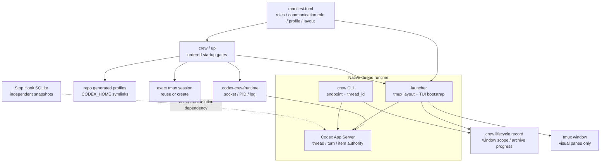

# Design

## Authorities

`loops/index.md` 负责 loop routing；所选 schema v2 `loops/<loop-id>/manifest.toml` 分别负责
该 package 的 ordered roles、exactly one `communication_role`、runtime profiles、model、
reasoning effort、service tier 与 tmux layout。`three-agent-dev` 仍是默认 loop。Package-local Role Markdown 是唯一
editable instruction source，installed profile TOML 只是派生 adapter。

Native `thread_id` 是 control identity。App Server 保存 thread/turn/item lifecycle；
codex-crew 不复制该 authority 到 SQLite 或 tmux。Ignored lifecycle record 只拥有 exact
cohort teardown scope/progress，不是 communication identity 或 binding database。

## One-click startup transaction

`crew LOOP_ID [PROJECT_DIR]` is the global ergonomic entrypoint; existing
`codex-crew up [PROJECT_DIR] --loop LOOP_ID` remains compatible. Both call `up_crew`, which owns
only the stable pre-launch orchestration and returns the unchanged `CrewLaunch` result. An omitted
`crew` project uses the invocation cwd's resolved path; an explicit project overrides it:

1. Resolve the repository and target project, load the manifest, then run deterministic profile
   install and check against `<repo>/.codex-crew/generated/`. `$CODEX_HOME` receives only the
   managed symlinks; Codex auth never enters the repository.
2. Probe `tmux has-session -t =SESSION`. Reuse success; otherwise create only
   `tmux new-session -d -s SESSION -c PROJECT_DIR`. Startup never kills a user session or window.
3. Resolve the fixed endpoint
   `unix://<repo>/.codex-crew/runtime/app-server.sock`. A ready endpoint is reused. Otherwise,
   validate the exact repo runtime directory and PID/socket/log artifact types before starting
   `codex app-server --listen ENDPOINT` with `stdin=DEVNULL`, detached process session, and stdout/
   stderr appended to the repo log.
4. Persist the child PID and poll protocol readiness with a bounded deadline. A dead owned PID
   permits cleanup only of the exact PID/socket paths. An invalid PID, orphan socket, or live PID
   paired with an unready endpoint fails closed without killing or launching over that process.
5. Only after every gate succeeds, call `launch_crew` with the same resolved `codex`, `tmux`,
   project, session, loop, explicit repo endpoint, and repository runtime lifecycle directory.

Every high-level `crew`/`up` target therefore shares the repository-owned explicit socket
`unix://<repo>/.codex-crew/runtime/app-server.sock`; this endpoint is never bare `unix://`.
The bare default is confined to low-level diagnostic/control endpoint resolution. Every launched
TUI still receives the explicit endpoint together with `-C` set to the resolved target.

`.codex-crew/` is ignored as one unit, so generated adapters and runtime artifacts never become
canonical source. The tracked authorities remain `bin/`, `codex_crew/`, and `loops/`.

## Launch transaction

1. Validate loop package, target project, tmux session and all manifest profiles.
2. Call paginated `thread/list` with exact `cwd` and interactive
   `sourceKinds=[cli,vscode]` to capture the pre-launch thread-id set. Live remote TUI evidence
   uses both sources, so neither may be excluded. Pagination and socket operations are bounded.
3. Generate one launch nonce and one role-specific marker. Each pane starts a fresh Codex TUI:
   `--profile`, `--strict-config`, `--yolo`, `--remote`, `-C`, bootstrap prompt.
4. Create one window and execute the selected manifest layout. `even-horizontal` splits each new
   role horizontally from the previous pane and then applies the named tmux layout, so the default
   `three-agent-dev` still splits twice. An explicit `split-plan` instead creates every non-root role
   from its declared earlier target with the declared horizontal/vertical direction and percentage,
   and never calls `select-layout`. The `api-budget-design` plan produces column-major `[1,2,2]`:
   Commander full-height on the left, `worker_3`/`worker_4` in the middle, and
   `worker_5`/`worker_6` on the right（左1/中23/右45）。
   No tmux option is a control-plane field.
5. Poll `thread/list`, subtract the pre-launch set, and `thread/read(includeTurns=true)` only the
   candidates. A correlation requires the exact marker line, exact `role=...` line, the
   `cwd`-filtered list, `turn.status=completed`, and an authoritative final-phase `agentMessage`
   whose first line exactly equals `role=<role>`.
6. After every manifest-defined role COMMIT, build an in-memory cohort envelope containing loop,
   project, session, exact window metadata, endpoint, communication role, and ordered
   role -> pane/thread/bootstrap-turn mappings. Send it through native `turn/start` to the exact
   communication thread, then wait for `turn/completed` and read the authoritative final-phase
   `agentMessage`.
7. After the communication handoff completed with first line exact `runtime_handoff=ready`, atomically
   persist the managed lifecycle record under `.codex-crew/runtime/crew-lifecycle/`. Persist failure
   preserves the window and returns no partial launch result.
8. Return a `CrewLaunch` only after record persistence. It exposes exact
   communication role/thread/pane plus handoff turn/status. For `three-agent-dev` the communication
   role is Commander; for `api-budget-design` it is Commander followed by four Workers. It also
   exposes the record path and exact external close command.
   Bootstrap or handoff deadline, `failed`, `interrupted`, wrong identity, missing final, or ambiguous matches raise
   `LaunchError` with the exact window ID and affected role. The CLI exits nonzero while preserving
   the visual window for diagnosis.

The production committed-identity deadline is 120 seconds for all manifest-defined profiled
`high` reasoning, Fast service tier bootstrap turns, and the handoff wait has its own 120-second
bound. The default loop has three bootstrap turns plus one Commander handoff turn. The API-budget
loop has five bootstrap turns—one Commander and four Workers—plus one Commander handoff
turn. Tests inject smaller bounded values where needed without weakening production defaults.

No `thread/start`, binding insert, or `codex resume` occurs before all TUI identity bootstraps
COMMIT; the first controller-created turn is the communication handoff. A tmux creation failure
kills only the just-created window. Discovery or handoff failure after successful pane startup
leaves the visible window intact but never returns a partial-success launch result. The handoff
envelope is not a binding; the post-handoff record is only a teardown ownership/progress manifest.

## Native control

Every crew operation accepts `endpoint` and one exact `thread_id`:

- `status`: `thread/read(includeTurns=true)` and validate one-or-zero active turns.
- `send`: read precondition, `turn/start`, bounded `-32001` retry, then reconcile ambiguous
  transport outcome from the before/after turn set and exact user item.
- `steer`: read and require `expectedTurnId` to equal the authoritative active turn.
- `wait`: read, return immediately if terminal, otherwise bare `thread/resume` to subscribe the
  current connection, read again, then consume `item/completed`, optional
  `thread/tokenUsage/updated`, `turn/completed`, and status events for the exact thread/turn.
- `final`: read only and require a completed turn with an authoritative final-phase
  `agentMessage`.
- `goal`: direct `thread/goal/get|set|clear` calls.
- `archive`: exact `thread/archive`; empty response is valid, and exact archived `thread/list`
  evidence reconciles a success that was not checkpointed.

`thread/resume` is not identity creation or configuration replay. It exists only inside an active
`wait` subscription window because `thread/read` is intentionally non-subscribing.

Codex App Server 0.150.1 exposes per-thread model token usage as the independent
`thread/tokenUsage/updated` notification; `Thread`/`Turn` read schemas provide no usage field or
per-thread usage pull request. The observable schema does not guarantee that this notification
precedes `turn/completed`, so an exact wait may complete without observing model usage. Native goal
`status`, `tokensUsed`, optional `tokenBudget`, and `timeUsedSeconds` are therefore the required
per-round accounting surface. A wait's `token_usage`, when present, is only an optional observed
cumulative model value: absence does not block completion, is never treated as zero, and cannot
support delta subtraction without an observed baseline. `cachedInputTokens` remains an input subset
when that optional breakdown is displayed.

The native control module has no tmux query/mutation function, role lookup, window locator,
database path, binding dataclass, or shared Stop fallback. Unknown/malformed thread state and Unix
WebSocket protocol violations fail closed.

## Recoverable close transaction

`crew close --window-id @N` validates the window ID and loads only the corresponding managed
schema v2 record. Before mutation it reads every remaining exact thread and refuses active turns.
Window reclaim is an atomic `pending → started → complete` state machine. The first attempt compares
live tmux session/window/name/index and pane set, checkpoints `started` before kill, kills only the
exact window, then checkpoints `complete`.

A `started` retry revalidates and kills when the exact window still exists. Only an explicit exact
tmux window-absent result reconciles directly to `complete`; general inspection failure, wrong
metadata, and pane mismatch remain errors. This closes the crash window between successful kill and
the completion checkpoint without broadening the destructive target.

Archive order is all sub-threads followed by the communication role. Each successful native
archive atomically extends `archived_roles`; failure leaves the record and reports remaining roles.
A retry skips checkpointed stages and uses archived listing evidence to reconcile an archive that
completed before its checkpoint. The managed record is removed only after the full cohort is
archived. The shared tmux session and App Server remain live; no transcript delete surface exists.

Lifecycle accepts window ID only. Ordinary send/wait/final/goal APIs continue to reject path,
window, and record locators and accept only exact native thread IDs.

## Independent Stop snapshots

`turn_stop_snapshot` stores cumulative transcript usage and final text captured by a direct Stop
Hook. `latest`, top-level `final`, and `summary` query this table. It has no crew binding table and
does not project completion metadata into tmux.

Native crew `final` never reads this database. Keeping the two surfaces separate prevents a stale
hook observation from overriding App Server turn/item authority.

## Public compatibility boundary

This migration intentionally removes window/role binding-backed target resolution and
direct/app-server runtime selection. Manifest schema v2 requires exactly one communication role;
the API package has no legacy summary role/profile/source shim. No compatibility module, lazy
re-export, deprecated schema, or alternate wire URI remains.

`crew LOOP_ID [PROJECT_DIR]` is the primary global startup surface, while `codex-crew up` remains
the compatible repository CLI surface. Low-level `launch` remains an endpoint diagnostic and does
not duplicate profile, session, or server ownership. Default window identity is
`crew-<loop-id>-<project-slug>` so different loops remain visually distinct; explicit
`--window-name` wins.

`codex://THREAD_ID` may be displayed only when opening a thread in the Codex App; transport calls
continue to use the explicit Unix endpoint plus raw native `thread_id`.
